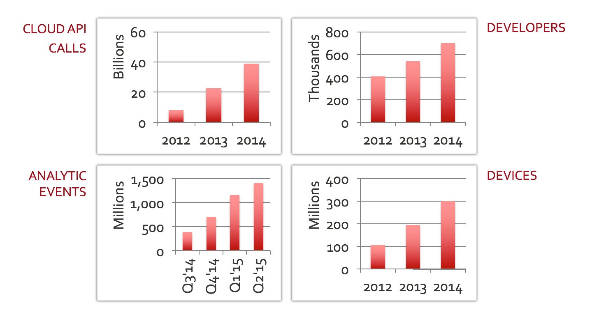
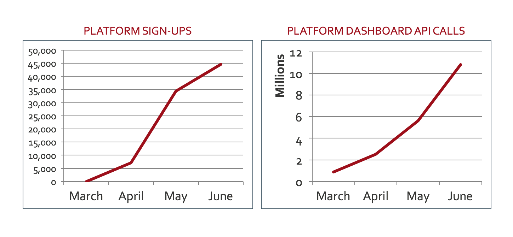
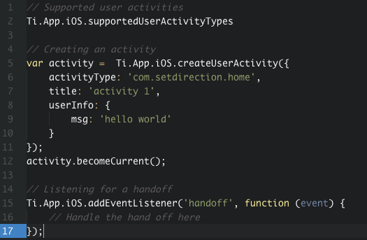

# Titanium 2015

Speaker: Rick Blalock, Appcelerator
Github: rblalock
Twitter: @rblalock

Presentation URL:
[https://github.com/rblalock/ConnectJS-2015](https://github.com/rblalock/ConnectJS-2015)

---

# Agenda

-  iOS 9
-  Hyperloop
-  Arrow SDK's
-  Android M
-  App Designer
-  App Beta
-  Analytics

---

# Ecosystem growth



---

# Sign-ups



---
# iOS 9

Sample app with new features:

[https://github.com/appcelerator-developer-relations/appc-sample-ti500](https://github.com/appcelerator-developer-relations/appc-sample-ti500)

---

# User Activity and Handoff



Used for the new Spotlight Search API (we'll look at this in a bit).  

Can be used to handoff activity from a browser to mobile, iPad to iPhone, etc.

---

# Spotlight Search


```javascript
var searchItems = [];
data.forEach(function (_row, _idx) {
	var itemAttr = Ti.App.iOS.createSearchableItemAttributeSet({
		itemContentType: "public.image",
		title: _row.specie_name,
		contentDescription: "Fishing Regulations",
		keywords: [_row.specie_name]
	});

	var item = Ti.App.iOS.createSearchableItem({
		uniqueIdentifier: "fishrules_" + _row.specie_fish_id,
		domainIdentifier: "com.app.here",
		attributeSet: itemAttr
	});
	searchItems.push(item);

	console.log('Creating index for ', _row.specie_name);
});

var indexer = Ti.App.iOS.createSearchableIndex();
indexer.addToDefaultSearchableIndex(searchItems, function(e) {});
```

---

# New iOS 9 Security Support

* All connections must support TLS 1.2 or greater, and use forward secrecy ciphers supported by iOS

* Certificates must use at least a SHA-256 fingerprint with either a 2048-bit or greater RSA key,
or a 256-bit or greater ECC key

* Application must be compatible with IPv6 DNS64/NAT64 networks as part of App Store submissions

---

# What do the new iOS 9 Security Requirements Mean?

* Do not to include hard-coded IPv4 address literals in your application, for example, 127.0.0.1
* You must now whitelist any URL's your application talks to, if they do not support the new iOS 9 security requirements

More Information, Google:

[iOS Developer Library: App Transport Security Technote](https://developer.apple.com/library/prerelease/ios/technotes/App-Transport-Security-Technote/index.html).

---

# Whitelisting Done in Tiapp.xml

```plist
<key>NSAllowsArbitraryLoads</key>
<true />

<key>NSExceptionDomains</key>
<dict>
	<dict>
	<!-- Loosen security measure for www.foo.com domain -->
	<key>www.foo.com</key>
	<dict>

	<!-- Set TLS v1.0 as the minimum TLS version -->
	<key>NSExceptionMinimumTLSVersion</key>
	<string>TLSv1.0</string>

	<!-- Can use other ciphers besides forward secrecy ciphers -->
	<key>NSExceptionRequiresForwardSecrecy</key>
	<false />

	<!-- Allow HTTP connections -->
	<key>NSExceptionAllowsInsecureHTTPLoads</key>
	<true />
</dict>
```

---

# watchOS 2.0

---

# CLI Support for watchOS 2.0

1. `--launch-watch-app` will automatically launch the watch sim and the app
2.  `ti create --type applewatch --name bar --template watchos2` will add an watchOS extension to your project

---

# Connectivity with a Ti app


```javascript
// ----- Watch app (in Swift) -------
@IBAction func fishfinderTap() {
	showOptions(self.favorites!, callback: { (selectedAnswers) -> Void in
		if selectedAnswers == nil {
			return;
		}

		if selectedAnswers!.count > 0 {
			self.session.sendMessage(
				["species": selectedAnswers![0], "type": "regulationBySpecies"],
				replyHandler: nil,
				errorHandler: nil
			)
		}
	})
}
```

```javascript
// (In Ti App) Listen for a message coming from the watch
Ti.WatchSession.addEventListener('receivemessage', function(e) {
	if (e.message.type === "regulationBySpecies") {
		Ti.WatchSession.sendMessage({
			regulation: someData
		});
	}
});
```

---

# Hyperloop Module
### No need for native modules

---

# Hyperloop Module

-	Direct access to native API's in JavaScript (which means no need to create a Titanium module)

-	iOS and Windows supported.  Android should be available in labs within a week.

-	3rd party library support: Available in Windows now, Android and iOS in 1-2 weeks.

Download at: [http://labs.appcelerator.com](http://labs.appcelerator.com)

---

## Hyperloop Concepts - Basic Usage

```javascript
// Require the native library you need:
var UILabel = require("UILabel");
var CGRect = require("CGRect");

// Use like you would in native code:
var label = UILabel.initWithFrame(CGRect.Make(0,0, 100, 50));

// Add to any Titanium UI View, like normal:
var win = Ti.UI.createWindow({ backgroundColor: "#eee" });
win.add( label.native );
```
---

## Hyperloop Concepts - Subclassing


```javascript
var CustomViewClass = Hyperloop.createClass({
	name: 'CustomView',
	super: 'UIView'
});

CustomViewClass.addInstanceMethod({
	signature: 'drawRect:',
	arguments: '{CGRect={CGPoint=dd}{CGSize=dd}}',
	callback: function (_arg) {
		var rect = new CGRect(_arg);
		console.log('Rect vals:', + rect);
	}
});

CustomViewClass.prototype.testMe = function(_arg) {
    console.log('Arg value was: ' + _arg);
};

var someView = UIView.extend('CustomView');
someView.testMe('It worked!');
```

[Reference Apple type encodings](https://developer.apple.com/library/mac/documentation/Cocoa/Conceptual/ObjCRuntimeGuide/Articles/ocrtTypeEncodings.html)

---

# Upcoming iOS Support

---

# App Thinning

* Will make the app file size smaller for users
* Separates files in the App Store based on OS version and "On-Demand Resources"
* "On Demand Resources" can be "tagged" and downloaded when needed, from the App Store.  When a device runs out of space, on demand resources will be removed as the OS sees fit. **NOTE** For development, you must host the files yourself, to test it.

---

# Support for App Thinning

* Not fully supported yet but moving that way
* The current CLI supports App Thinning now, for launch and icon images (It puts them in the AssetsCatalog automatically)

**New Feature!**

You no longer need multiple icons / launch images for iOS.  As long as you have the largest required image for the icon / launch image, the CLI will create the appropriate images.

---

# Auto-Layout

1.  Uses Titanium's current layout properties so the change is transparent to the developer
2.  As long as an app is using Ti.UI.SIZE / FILL / %'s, auto-layout will apply.
3.  This is important for the future of iOS since Apple is requiring auto-layout in a lot of scenarios, like the split screen iPad feature.

---

# Arrow Client-Side SDK's

__Vanilla JavaScript Example:__

```javascript
var model = Arrow.getModel('products');
model.findAll(function (err, results) {});
```

__Obj-C Example__

```obj-c
[Products findAll:^(NSError *error, NSArray<Product *> *result, NSHTTPURLResponse *response) {
    for (Products *product in result) {
        NSLog(@"%@", product.ID);
    }
}];
```

---

# Android M

Coming Nov 4th (v5.1.0):

- Card View
- Reveal
- Runtime permissions

(Some of these are available in master, today)

---


---

# App Preview

---

# Analytics

---
